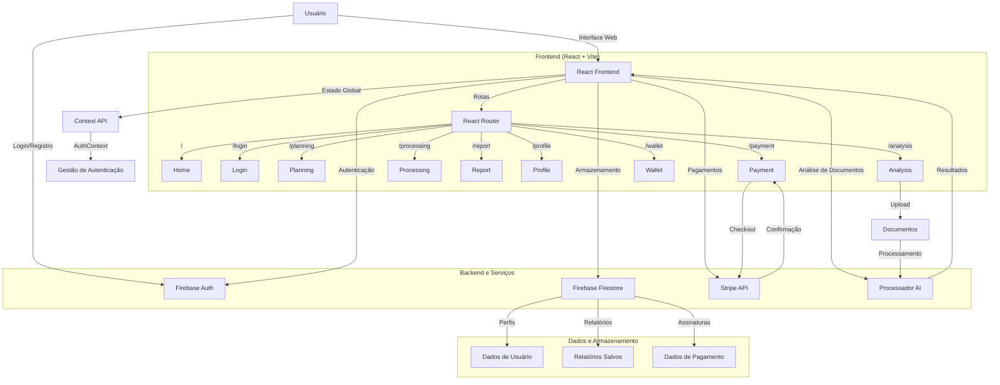
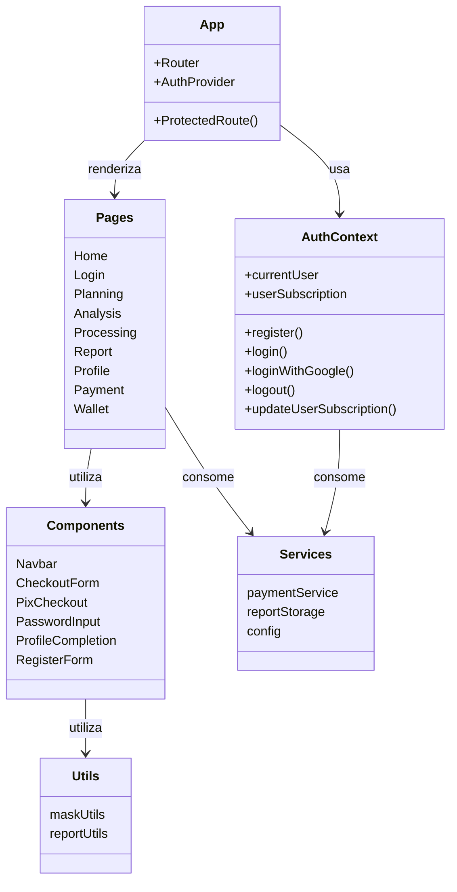
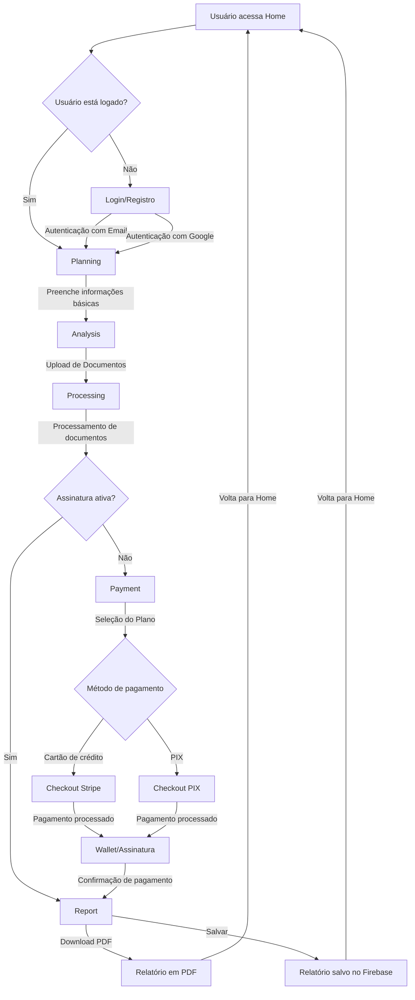

# CredAnalyzer - Análise de Documentação para Crédito


CredAnalyzer é uma plataforma de análise de documentação para crédito impulsionada por inteligência artificial. A aplicação permite que empresas e usuários façam upload de documentos financeiros e fiscais para obter análises precisas, reduzir tempo de processamento e tomar decisões mais inteligentes relacionadas à elegibilidade para crédito.

## 🚀 Funcionalidades

- **Autenticação**: Login por email/senha ou Google
- **Assinatura**: Planos mensais com diferentes níveis de acesso
- **Upload de Documentos**: Envio seguro de documentos financeiros e fiscais
- **Processamento Inteligente**: Análise automática de documentos com IA
- **Relatórios Detalhados**: Geração de relatórios abrangentes em formato PDF
- **Dashboard Pessoal**: Gerenciamento de planos e relatórios
- **Pagamentos Integrados**: Suporte para cartão de crédito e PIX

## 📋 Fluxo da Aplicação

### 1. Planejamento

O usuário inicia o processo fornecendo informações básicas sobre a empresa e o crédito desejado:
- Segmento da empresa
- Objetivo do crédito
- Valor do crédito buscado
- Tempo de operação da empresa

### 2. Análise de Documentos

O usuário seleciona e envia os documentos relevantes:
- Cartão CNPJ (obrigatório)
- Imposto de renda dos sócios
- Registrato/SCR
- Situação fiscal
- Faturamento declarado
- Faturamento gerencial
- SPC/Serasa
- Demonstrativos financeiros

### 3. Processamento

O sistema processa os documentos enviados usando inteligência artificial para extrair informações relevantes.

### 4. Relatório

O usuário recebe um relatório detalhado com:
- Análise financeira
- Indicadores de elegibilidade para crédito
- Recomendações personalizadas
- Opção para download em PDF

## 🧩 Arquitetura da Aplicação



## 💻 Tecnologias Utilizadas

- **Frontend**: React.js, Vite
- **Backend**: Firebase (Authentication, Firestore)
- **Pagamentos**: Stripe, PIX
- **Processamento de PDF**: html2pdf.js
- **Estilização**: CSS puro
- **Autenticação**: Firebase Authentication
- **Roteamento**: React Router Dom

## 🧩 Estrutura de Componentes



## 📱 Estrutura de Páginas

- **Home**: Página inicial com informações sobre o serviço
- **Login**: Autenticação de usuários
- **Planning**: Entrada de informações básicas sobre a empresa
- **Analysis**: Upload de documentos para análise
- **Processing**: Tela de processamento dos documentos
- **Report**: Exibição do relatório final de análise
- **Profile**: Gerenciamento de perfil do usuário
- **Payment**: Seleção e pagamento de planos
- **Wallet**: Gestão de assinaturas e créditos

## 🔀 Fluxo de Usuário



## 📊 Modelo de Assinatura

A plataforma opera com um sistema de créditos para relatórios, oferecendo três planos principais:

| Plano | Relatórios | Preço (R$) | Desconto |
|-------|------------|------------|----------|
| Básico | 20 | 35,00 | 0% |
| Padrão | 40 | 55,00 | 21% |
| Premium | 70 | 75,00 | 39% |

## 🛠️ Instalação e Configuração

### Pré-requisitos
- Node.js (v18 ou superior)
- npm ou yarn
- Conta no Firebase
- Conta no Stripe (para processamento de pagamentos)

### Passos para Instalação

1. Clone o repositório
   ```bash
   git clone https://github.com/seu-usuario/CredAnalyzer.git
   cd CredAnalyzer
   ```

2. Instale as dependências
   ```bash
   npm install
   # ou
   yarn install
   ```

3. Configure as variáveis de ambiente
   ```
   # Crie um arquivo .env na raiz do projeto
   VITE_API_KEY=sua_api_key_do_firebase
   VITE_AUTH_DOMAIN=seu_auth_domain
   VITE_PROJECT_ID=seu_project_id
   VITE_STORAGE_BUCKET=seu_storage_bucket
   VITE_MESSAGING_SENDER_ID=seu_messaging_sender_id
   VITE_APP_ID=seu_app_id
   VITE_MEASUREMENT_ID=seu_measurement_id
   VITE_STRIPE_PUBLIC_KEY=sua_stripe_public_key
   VITE_DEV_MODE=false
   ```

4. Inicie o servidor de desenvolvimento
   ```bash
   npm run dev
   # ou
   yarn dev
   ```

5. Acesse a aplicação em `http://localhost:5173`

## 🚀 Deployment

Para criar uma versão de produção, execute:
```bash
npm run build
# ou
yarn build
```

Os arquivos gerados estarão no diretório `dist` prontos para serem servidos por qualquer servidor web estático.

## 🔧 Variáveis de Ambiente

Para configurar o ambiente de desenvolvimento ou produção, configure as seguintes variáveis:

- `VITE_DEV_MODE`: Define se a aplicação está em modo de desenvolvimento (`true`) ou produção (`false`)
- `VITE_API_URL`: URL base da API de backend
- `VITE_API_KEY`: Chave da API do Firebase
- `VITE_AUTH_DOMAIN`: Domínio de autenticação do Firebase
- `VITE_PROJECT_ID`: ID do projeto no Firebase
- `VITE_STORAGE_BUCKET`: Bucket de armazenamento do Firebase
- `VITE_MESSAGING_SENDER_ID`: ID do remetente de mensagens do Firebase
- `VITE_APP_ID`: ID da aplicação no Firebase
- `VITE_MEASUREMENT_ID`: ID de medição do Firebase
- `VITE_STRIPE_PUBLIC_KEY`: Chave pública do Stripe

## 📄 Licença

Este projeto está licenciado sob a [Licença MIT](LICENSE).

## 🤝 Contribuição

Contribuições são bem-vindas! Sinta-se à vontade para abrir issues ou pull requests para melhorar o projeto.

1. Fork este repositório
2. Crie sua branch de feature (`git checkout -b feature/AmazingFeature`)
3. Commit suas mudanças (`git commit -m 'Add some AmazingFeature'`)
4. Push para a branch (`git push origin feature/AmazingFeature`)
5. Abra um Pull Request